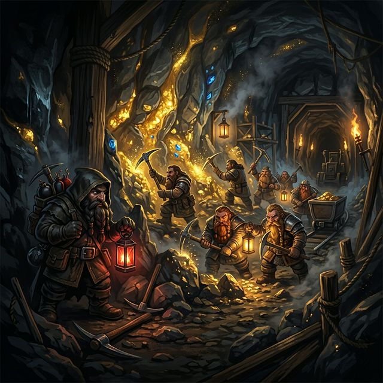

<div align="center">



# 💎 Saboteur Online ⛏️

[](https://flutter.dev)
[](https://firebase.google.com)
[](https://dart.dev)

**¿Amigo o Traidor? La fiebre del oro ha llegado.**

</div>

---

### 🌟 La Misión
En las profundidades de las minas olvidadas, un grupo de enanos busca desesperadamente el gran tesoro: **¡El Oro!** 💰 Pero ten cuidado... entre tus compañeros se esconde un **Saboteador** con un solo objetivo: evitar que el oro sea descubierto a toda costa.

### 🎮 Características principales
- **Multijugador en tiempo real**: Juega con amigos o desconocidos de todo el mundo.
- **Roles Ocultos**: ¿Eres un minero honesto o el astuto saboteador?
- **Estrategia y Engaño**: Bloquea caminos, rompe herramientas o construye túneles secretos.
- **Interfaz Premium**: Una experiencia visual fluida y moderna construida con Flutter.

### 🛠️ Stack Tecnológico
- **Frontend**: Flutter (Web, Android, iOS)
- **Backend**: Firebase Auth & Cloud Firestore
- **Estilo**: Vanilla CSS & Custom Design System

---

### 🚀 Cómo empezar
Si quieres probar el juego localmente:

1. **Clona el repositorio**:
   ```bash
   git clone https://github.com/DanieLuna15/Saboteur-DL.git
   ```
2. **Instala las dependencias**:
   ```bash
   flutter pub get
   ```
3. **Ejecuta el proyecto**:
   ```bash
   flutter run
   ```

---

<div align="center">
Hecho con ❤️ por Daniel Luna
</div>

